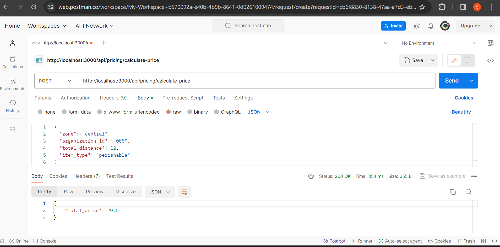

# Food Delivery App Backend

This project is a backend application for a food delivery app built using Node.js. The primary focus of this application is to implement a dynamic pricing module to calculate the total cost of food delivery based on various factors such as distance, item type, and zone.

## Features

- **Dynamic Pricing Module**: Calculate delivery costs for different types of food items across various zones based on distance and item type.
- **API Endpoints**: Expose REST API endpoints to handle pricing calculations and other functionalities.
- **Database**: Uses PostgreSQL as the database to store organization, item, and pricing information.
- **Code Quality**: Follows recognized linting standards (e.g., Airbnb's style guide) to maintain code quality.

## Database Schema

The database schema consists of three main entities:

- **Organization**: Stores information about different organizations involved in food delivery.
- **Item**: Represents different types of food items, identified by type (perishable, non-perishable) and description.
- **Pricing**: Stores pricing details linked to an organization and item, including zone-specific base pricing and per km rates.

## API Endpoints

### Calculate Delivery Cost

- **Endpoint**: `/calculatePrice`
- **Method**: POST
- **Request Payload**:
  ```json
  {
    "zone": "central",
    "organization_id": "005",
    "total_distance": 12,
    "item_type": "perishable"
  }
  ```
- **Response**:
  ```json
  {
    "total_price": 20.5
  }
  ```

## Setup Instructions

1. Clone the repository:

   ```bash
   git clone <repository-url>
   ```

2. Install dependencies:

   ```bash
   cd Food-Delivery-App---Backend
   npm install
   ```

3. Set up PostgreSQL:

   - Install PostgreSQL if not already installed.
   - Create a new database named `food_delivery`.
   - Update database connection settings in `config.js` if necessary.

4. Run database migrations:

   ```bash
   npx sequelize-cli db:migrate
   ```

5. Start the server:

   ```bash
   npm start
   ```

6. The server will start running on `http://localhost:3000`.

## Deployment

This application can be deployed on platforms like [Render](https://render.com/) using the following steps:

1. Create an account on Render and set up a new web service.
2. Configure the necessary environment variables (e.g., database connection settings).
3. Deploy the application using the provided deployment commands.

## Testing the API (using POSTMAN)

1. **Start Your Node.js Server:**
   Make sure your Node.js server is running. If it's not already running, you can start it by running `npm start` in your project directory.

2. **Open Postman:**
   Open the Postman application on your computer.

3. **Create a New Request:**
   Click on the "New" button in Postman to create a new request.

4. **Set Request Type and URL:**
   - Choose the appropriate HTTP method (e.g., POST) from the dropdown menu.
   - Enter the URL of your API endpoint. The URL would be `http://localhost:3000/api/pricing/calculate-price`.

5. **Add Request Body:**
   - If your API endpoint expects a request body, switch to the "Body" tab in Postman.
   - Select the appropriate format (e.g., JSON) and enter the request payload. For example:
     ```json
     {
       "zone": "central",
       "organization_id": "005",
       "total_distance": 12,
       "item_type": "perishable"
     }
     ```

6. **Send the Request:**
   Click on the "Send" button in Postman to send the request to your API endpoint.

7. **View Response:**
   - Postman will display the response from your API endpoint in the "Response" section.
   - You can view the response status code, headers, and body.

## Documentation

Notion Doc Link: `https://orchid-heather-5ae.notion.site/Coding-Task-Backend-Development-for-a-Food-Delivery-App-40bc318c0cde42f9893ab8e26271be94?pvs=4`


